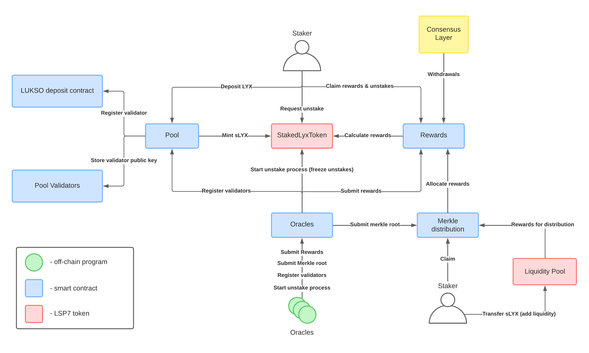

# Introduction

In this documentation you will find details on the innerworkings of the LEEQUID protocol as well as some fundamental concepts related to liquid staking. The information here contained will help you understand how the platform operates, as well as the smart contract logic that ensures non-custodial processing of staked LYX and the liquidity of the liquid staking derivative token, sLYX.

The documentation of LEEQUID is under continuous improvement. We encourage you to send us your suggestions and reach us through our public channels.

## About LEEQUID

LEEQUID is a non-custodial liquid staking protocol for the LUKSO blockchain. The protocol emerged as a fork of [Stakewise V2](https://github.com/stakewise/contracts/tree/master/contracts/pool), a liquid staking pool available in the Ethereum blockchain pre-Shapella upgrade. The LEEQUID protocol, deployed on the LUKSO blockchain, is the result of numerous modifications to the Stakewise V2 protocol. These modifications include adjusting to LSP standards, including LSP7 tokens, updating solidity code the newest version, and an unstaking mechanism built from scratch, which was made available for EVM blockchains like LUKSO only after the [Shapella upgrade](https://blog.ethereum.org/2023/03/28/shapella-mainnet-announcement), on April 12th.

LEEQUID users can deposit and withdraw LYX at any time, accruing rewards through the protocol’s interest bearing token, sLYX. The rewards, which are distributed evenly to all stakers according to their share of the pool, come from the work of Proof of Stake validators, registered automatically in the LUKSO blockchain by the LEEQUID protocol. By running it’s own node infrastructure, LEEQUID ensures maximum validator performance, closely monitoring validator metrics, providing staking as a service in the LUKSO blockchain for the first time.

There is no upfront cost for the users staking through LEEQUID, instead the protocol takes a 10% fee on the rewards accumulated. See the section on [reward distribution](collecting-rewards/reward-distribution-in-the-leequid-protocol.md) for more details.

The diagram below is a graphical representation of the interactions between LEEQUID's oracles, the smart contracts in the protocol and the user's actions. The information contained in the diagram is complemented by this documentation as well as the official [Github repository](https://github.com/dropps-io/leequid-contracts) of the protocol.

<figure><figcaption>
The LEEQUID protocol overview
</figcaption></figure>

### Securing the LEEQUID protocol

Once LYX leaves the user's wallet into the LEEQUID protocol, stake is handled in a predictable, programmed, non-custodial way. Deposited LYX coins will move through the staking contracts and into LUKSO’s deposit contract, where they will sit until an unstake request activates their withdrawal, return to the protocol, and finally, redemption to the user wallet. The flow of LYX inside LEEQUID is explained in detail in [this section](staking/deposited-lyx-lifecycle.md).

The [code in the protocol](https://github.com/dropps-io/leequid-contracts) is open source and has been audited by [Consensys](https://consensys.io/diligence/), one of the most reputable auditors in the web3 space.

Nonetheless (and akin to all staking protocols) there are risks to consider. You can read more about them in the [Security section](leequid-in-depth/protocol-security-and-risks/) of the documentation.

