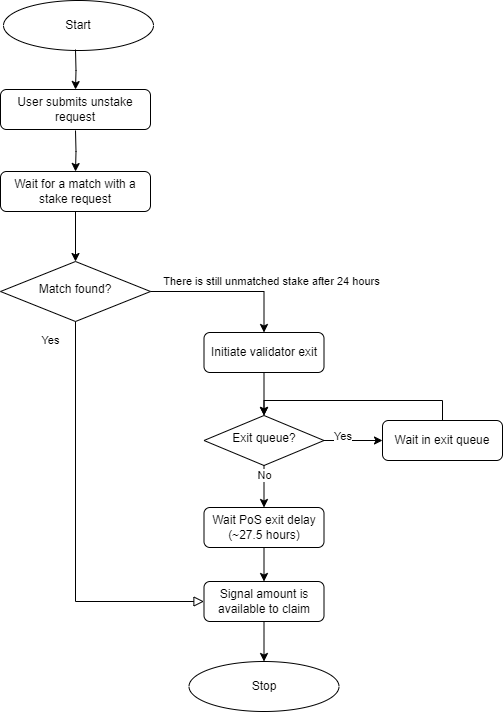

# Unstaking through the staking pool

## Overview

If a user wants to unstake at 1:1 ratio between sLYX and LYX, he might choose to go through the staking pool, initiating a request to unstake, which will take between 1 to 2 days to complete. Unstaking implies redeeming sLYX tokens for LYX coins. The sLYX tokens will be burnt and the LYX transferred to the user address.&#x20;

The process first starts with the LEEQUID protocol attempting to [match the unstake request to new stake](matching-unstake-to-stake-requests.md) flowing into the protocol. Then, if unsuccessful after a period of 24 hours, it triggers the removal of the necessary amount of validators from the Proof of Stake protocol, which will free the capital employed in them and return it to the LEEQUID protocol.

<figure><figcaption>
The unstake process inside the LEEQUID protocol
</figcaption></figure>

If after 24 hours there is still more than 32 LYX in unprocessed unstake requests, the LEEQUID nodes broadcast to the consensus network the wish to voluntarily exit the necessary validators to cover for the withdrawal request. The validators are then added to the exit queue by the consensus network. When there is no remaining exit queue, it will take around 30 minutes until a validator is stopped. At this stage, the validator will become inactive but its deposit of 32 LYX will remain locked in the LUKSO deposit contract.&#x20;

A 27 hour escrow period follows, similar to an intentional exit delay, where the validator, although removed from its duties, might still be slashed for bad behavior in previous blocks. If the exit delay terminates without incidents, the deposit is finally returned to the withdrawal address and the validator is completely out of the Proof of Stake protocol.&#x20;

Once the deposit leaves the Proof of Stake protocol to the LEEQUID protocol, the claim action will be available for the user and the funds will finally reach the user wallet once he claims the unstaked value.&#x20;

## Cashing out rewards

Redeeming your sLYX tokens for LYX, regardless of the method chosen (either unstaking through the staking pool or by swapping the sLYX), doesn’t automatically withdraw rewards. If a user also wishes to withdraw rewards accrued while staking, they must be withdrawn with a second transaction, initiated via the dashboard on the LEEQUID platform, under the “Rewards” section.

