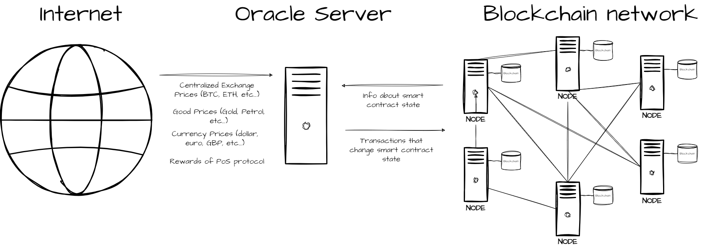

# Oracles

Oracles are a set of software components designed to bridge the blockchain to other internet services, like web API's. Most Oracles are made of:

* A smart contract, which is the oracles' gateway to interact with other contracts
* A blockchain node, which can quickly read the state of the blockchain
* A server running 24 hours, which can fetch data from other networks and monitor the blockchain to act on when specific programmed conditions are met (like the Pool contract balance reaching 32 LYX, for example).
* A normal blockchain address, with its private key. The oracle uses it to sign transactions to the blockchain, performing automated actions on smart contracts (for example registering validators).

The name _oracle_ comes from the fact that a set of components work together to bridge the information between the on-chain and off-chain worlds, sometimes triggering smart contract operations by sending automated transactions to them.&#x20;

<figure><figcaption><p>Overview of the Oracle interactions between blockchains and the rest of the internet</p></figcaption></figure>

The above graph displays the Oracle outside of the blockchain network. However, an oracle can include a blockchain node to facilitate reading the state of the blockchain, thus belonging to the network as well.&#x20;

Oracles interact with the world outside of blockchain and interact with smart contracts. In the case of staking protocols, for example, Oracles query the consensus layer explorer to obtain information about the total rewards delivered to the staking protocol. This information is not available inside the execution layer of the blockchain. Once the oracles calculate the rewards for a period of, for example, 12 hours, they send a transaction to the execution layer, updating the reward amount in the protocol and consequently updating user reward balances.

#### The Oracles contract - overview

The Oracles contract forms an integral part of our Liquid Staking application, acting as a bridge between our on-chain protocol and off-chain oracles system.

It primarily serves as storage for accounts tasked with submitting or updating values based on off-chain data. A minimum threshold of inputs from various oracles is required for data submission.

The contract maintains an on-chain record of accounts with `ORACLE_ROLE` and `ORCHESTRATOR_ROLE`. It exposes functionalities to add, remove, and check whether an account has a particular role.

#### The Oracles contract - key features

**On-chain role management**

The contract maintains an on-chain record of accounts with `ORACLE_ROLE` and `ORCHESTRATOR_ROLE`. It exposes functionalities to add, remove, and check whether an account has a particular role.

**Oracles voting**

Oracles collectively participate in voting for updating reward-related values and validator-related values. Only when enough signatures (more than 2/3 of total oracles) are provided, the values are updated. This offers a level of protection against malicious data manipulation.

**Stake and unstake management**

The contract communicates with other contracts to manage staking and unstaking. Particularly, it interacts with the StakedLyxToken contract to manage the unstake requests.

**Merkle root submission**

Oracles vote on submitting a new Merkle root. This submission only happens when enough oracles have signed the data, and it's the appropriate time for voting, ensuring transparency and data integrity.

**Validator registration**

This contract facilitates validator registration by orchestrating collective voting of Oracles.

**Robust security**

The contract includes protective measures to prevent double voting by the same oracle and any unauthorized access. It uses the OpenZeppelin library for secure, tested contract standards.

**Pause functionality**

It incorporates _Ownable_ and _Pausable_ capabilities to provide admin control and emergency stop mechanisms.

#### Understanding the workflow with oracles

1. Oracles are added to the contract. Their collective vote decides various actions.
2. The reward amounts fetched from the consensus layer API are submitted by voting. Each oracle signs off on total rewards and validator counts. Only when the threshold number of signatures is collected, these values are updated.
3. Similarly, a new Merkle root can be submitted through collective voting.
4. For validator registration, collective oracle signatures are required for registering multiple validators at once.
5. The contract collaborates with other contracts (like PoolValidators, StakedLyxToken, etc.) to achieve specific tasks like updating validator counts or managing unstake requests.

An understanding of the broader liquid staking ecosystem will provide further context to how the Oracles contract fits in.

#### Functions called by the Oracles contract


```solidity
function updateTotalRewards(uint256 newTotalRewards) external override {
        require(msg.sender == oracles, "Rewards: access denied");

        uint256 totalDeposits = stakedLyxToken.totalDeposits();
        if (totalDeposits == 0) return;

        uint256 feesCollected = feesEscrow.transferToRewards();
        uint256 periodRewards = newTotalRewards + uint128(feesCollected) - totalRewards;
        if (periodRewards == 0) {
            lastUpdateBlockNumber = block.number;
            emit RewardsUpdated(0, newTotalRewards, feesCollected, rewardPerToken, 0, 0);
            return;
        }

        // calculate protocol reward and new reward per token amount
        uint256 protocolReward = periodRewards * protocolFee / 1e4;
        uint256 prevRewardPerToken = rewardPerToken;
        uint256 newRewardPerToken = prevRewardPerToken + ((periodRewards - protocolReward) * 1e18) / totalDeposits;
        uint128 newRewardPerToken128 = uint128(newRewardPerToken);

        // store previous distributor rewards for period reward calculation
        uint256 prevDistributorBalance = _balanceOf(address(0), prevRewardPerToken);

        // update total rewards and new reward per token
        (totalRewards, rewardPerToken) = (uint128(newTotalRewards), newRewardPerToken128);
        totalFeesCollected = totalFeesCollected + uint128(feesCollected);

        uint256 newDistributorBalance = _balanceOf(address(0), newRewardPerToken);
        address _protocolFeeRecipient = protocolFeeRecipient;
        if (_protocolFeeRecipient == address(0) && protocolReward > 0) {
            // add protocol reward to the merkle distributor
            newDistributorBalance = newDistributorBalance + protocolReward;
        } else if (protocolReward > 0) {
            // update fee recipient's checkpoint and add its period reward
            checkpoints[_protocolFeeRecipient] = Checkpoint({
                reward: uint128(_balanceOf(_protocolFeeRecipient, newRewardPerToken) + protocolReward),
                rewardPerToken: newRewardPerToken128
            });
        }

        // update distributor's checkpoint
        if (newDistributorBalance != prevDistributorBalance) {
            checkpoints[address(0)] = Checkpoint({
                reward: uint128(newDistributorBalance),
                rewardPerToken: newRewardPerToken128
            });
        }

        lastUpdateBlockNumber = block.number;
        emit RewardsUpdated(
            periodRewards,
            newTotalRewards,
            feesCollected,
            newRewardPerToken,
            newDistributorBalance - prevDistributorBalance,
            _protocolFeeRecipient == address(0) ? protocolReward: 0
        );
    }
```




```solidity
 /**
     * @dev Set unstake processing status to true. Block any new unstake request and stakes/unstakes matching.
     * The ensure the pending unstake value doesn't change while being processed.
     * Only callable by the oracles contract. Requires unstaking not to be in progress.
     * Emits an UnstakeReady event.
     */
function setUnstakeProcessing() external override {
        require(msg.sender == oracles, "StakedLyxToken: access denied");
        require(!unstakeProcessing, "StakedLyxToken: unstaking already in progress");
        require(totalPendingUnstake >= VALIDATOR_TOTAL_DEPOSIT, "StakedLyxToken: insufficient pending unstake");

        unstakeProcessing = true;
        uint256 validatorsToUnstake = (totalPendingUnstake - (totalPendingUnstake % VALIDATOR_TOTAL_DEPOSIT)) / VALIDATOR_TOTAL_DEPOSIT;
        validatorsExitedThreshold = pool.exitedValidators() + validatorsToUnstake;
        emit UnstakeReady(validatorsToUnstake);
    }
```




```solidity
  /**
     * @dev Submit the unstake amount so users can claim their unstakes.
     * Only callable by the oracles contract. Requires unstaking to be in progress.
     * Requires the unstake amount to be a multiple of VALIDATOR_TOTAL_DEPOSIT LYX.
     * Emits an {UnstakeProcessed} event.
     * @param exitedValidators - The number of new exited validators.
     */
function unstakeProcessed(uint256 exitedValidators) external override {
        require(msg.sender == oracles, "StakedLyxToken: access denied");
        require(unstakeProcessing, "StakedLyxToken: unstaking not in process");

        uint256 unstakeAmount = exitedValidators * VALIDATOR_TOTAL_DEPOSIT;

        if (unstakeAmount > totalPendingUnstake) {
            rewards.sendToPoolWithoutActivation(unstakeAmount - totalPendingUnstake);
            unstakeAmount = totalPendingUnstake;
            totalPendingUnstake = 0;
            unstakeRequestCurrentIndex = unstakeRequestCount;
            _unstakeRequests[unstakeRequestCount].amountFilled = _unstakeRequests[unstakeRequestCount].amount;
        }
        else {
            totalPendingUnstake -= unstakeAmount;
            uint256 amountToFill = unstakeAmount;

            for (uint256 i = unstakeRequestCurrentIndex; i <= unstakeRequestCount; i++) {
                UnstakeRequest storage request = _unstakeRequests[i];
                if (amountToFill > (request.amount - request.amountFilled)) {
                    amountToFill -= (request.amount - request.amountFilled);
                    continue;
                } else {
                    if (amountToFill == (request.amount - request.amountFilled) && i < unstakeRequestCount) {
                        unstakeRequestCurrentIndex = i + 1;
                    } else {
                        request.amountFilled += uint128(amountToFill);
                        unstakeRequestCurrentIndex = i;
                    }
                    break;
                }
            }
        }

        totalUnstaked += unstakeAmount;

        // If less pending unstake under VALIDATOR_TOTAL_DEPOSIT, it means the unstake is completed
        if (pool.exitedValidators() + exitedValidators >= validatorsExitedThreshold) {
            unstakeProcessing = false;
        }

        emit UnstakeProcessed(unstakeAmount, totalPendingUnstake);
    }
```

