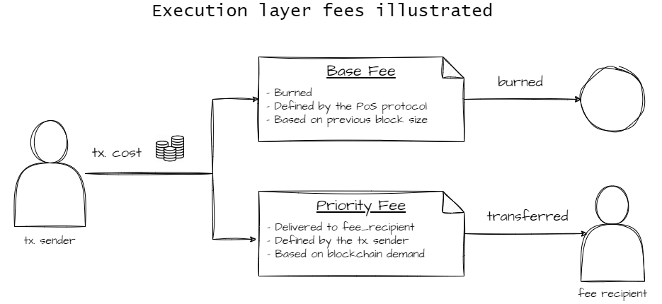

# Reward calculation in Proof of Stake

Rewards earned by validators come mainly from their attesting duties in the consensus protocol. These are called consensus layer rewards and they are **minted** in every single slot (the basic time unit of the Proof of Stake algorithm) in the LUKSO blockchain. This means that new LYX is being minted every slot.

On the other hand, users pay gas fees to have the network execute their transactions. In Proof of Stake, the gas paid by users doesn't go to the validators. Instead, it is burned. This means that LYX is being burned in every slot.&#x20;

It is possible for users to send an extra tip, on top of gas paid, to the validator chosen as the block proposer in a given slot. This tip is makes up a big part of execution layer rewards, and is called the priority fee. Besides the priority fee, there is the famously known MEV (Maximal Extractable Value), which can be extracted through the execution layer as well.

### Consensus layer rewards

The new LYX minted in each slot makes up the total consensus layer rewards for that slot and accrues directly in the participating validators' balances. Slowly, the validator balance will start surpassing 32 LYX, but it will never go way beyond because rewards are periodically processed by the network and withdrawn into the validator's withdrawal address. This withdrawal is called a _partial withdrawal_, in contrast with exiting the validator and withdrawing the 32 LYX, which is called a _full withdrawal_.

> A _partial_ withdrawal will be performed automatically, in a regular period, for the validators whose balance is above 32 ETH (due to their rewards). The exceeding amount of ETH will be transferred to the Ethereum account they have declared in the transaction they submitted to the Deposit Contract (in the field `eth1_withdrawal_address`) - [Nethermind-eth blog](https://medium.com/nethermind-eth/bls-signatures-withdrawals-bbf38658c242#2be3)

The blockchain account specified as the _withdrawal address_ for all validators operated by LEEQUID is the address of the _Rewards_ contract. There is a constant flow of LYX into this contract and periodically the Oracles calculate the amount of _partial withdrawals_ collected and update the `totalRewards` collected by the protocol.

The consensus layer rewards accrued by validators come from the duties they perform in securing the blockchain, by participating in the consensus protocol. Among them, we count:

* **Attestations**. Every time a validator “validates” a block, it verifies if such block respects the chain rules to choose its parent block and also that its content is correct (no double spending). This is the most steady source of rewards and will amount to the majority of the income. A validator does one attestation every epoch (6.4 minutes).
* **Block proposer rewards**. Occasionally a validator might be chosen to be the next to propose a new valid block for the blockchain. This choice uses an algorithm for randomness where the probability of a validator being selected is [roughly ](#user-content-fn-1)[^1]`1/N` (where N = total active validators). The block proposer gets a hefty reward, much bigger than attestation rewards. However, this event happens to one validator, on average, once per week, and this likelihood decreases as the number of total validators increases.
* **Sync Committee**. 512 validators are randomly selected once every 256 epochs (27.3 hours). For any given validator this will happen rarely; with 500,000 validators, the expected interval between being chosen for sync committee duty is around 37 months. However, during the 27-hour period of participation, the rewards are considerably increased. While a validator is part of the currently active sync committee, it is expected to continually sign the block header that is the new head of the chain at each slot. The purpose of the sync committee is to allow light clients to keep track of the chain of block headers. Sync committee participants receive a reward in every slot they correctly perform their duties.&#x20;
* **Whistleblower reward.** When a validator is the block proposer, his block can include evidence of a slashable offence made by other validator. Other network participants confirm the proposed block along with the evidence, and the offending validator is slashed. This results in a reward of 0.0625 ETH per offence reported (up to 18 in a single block), so it can go as far as 1.125 ETH. In spite of this, slashing events are very rare, and even rarer is the opportunity to be the block proposer reporting one.

### Execution layer rewards

Besides the 3 types of consensus layer rewards, there is a special type of reward for block proposers. In other words, when a validator is chosen to become a block proposer (using an algorithm called RANDAO for pseudo-randomness), it can:

* **Receive priority fees** for prioritize transactions (also known as tips)
* **Explore MEV**, i.e., Maximal Extractable Value opportunities&#x20;

These are the two sources of execution layer rewards. In contrast with the ones _minted_ by the consensus layer, execution layer rewards originate instead from blockchain users submitting transactions, and paying for them. When a user submits a transaction, the amount paid is divided in two: the base fee and the priority fee.

<figure><figcaption>
The flow of execution layer transaction fees
</figcaption></figure>

Besides the priority fee, being the block proposer allows a validator to choose the order of transactions in that block. Using tools to analyze their effect, the [block proposer can scan](#user-content-fn-2)[^2] pending transactions and identify profit opportunities which can be seized by replacing the pending transaction with a copy, only altering the profiting address. Here are some examples of MEV opportunities:

* Frontrunning: Directly replace a transaction that would result in profit.
* Sandwich attack: It also involves frontrunning, but with the specific goal of profiting from a large swap intention. Two transactions are added in between a large swap. One which buys the token before, at a lower price, and one that sells them after the swap, profiting from the price change due to the large swap inside the sandwich.
* Arbitrage: There are many bots submitting the same arbitrage transaction at the same time. The block proposer can be one of them and is able to choose its own transaction and include it in the block.&#x20;
* Liquidations: Lending protocols rely on external participants called liquidators to liquidate undercollateralized loans, in exchange of a fee.&#x20;

Payments from MEV can be very generous, but they vary considerably, according to network usage. In the infancy of the LUKSO blockchain, MEV will mostly be inexistent because there will be no DeFi protocols to create the opportunities.&#x20;

It is true that frontrunning and profiting from the ability to "sniff" into other users' transactions might be unfair and harm the overall health of the blockchain ecosystem. There's currently an open debate on how to tackle the downsides of MEV and on how to correctly proceed about [the building and proposing](https://ethereum.org/nl/roadmap/pbs/) of new blocks to the chain.&#x20;

[^1]: The probability is not exactly 1/N because the algorithm weights each validator by its effective balance, meaning a balance < 32 LYX will result in less chance of being selected for block proposal.

[^2]: Sometimes the task of finding MEV opportunities is outsourced to entities called searchers, which are bots highly specialized in MEV. The bots build the block and the validator checks and proposes it. The profits are then split between the two.
