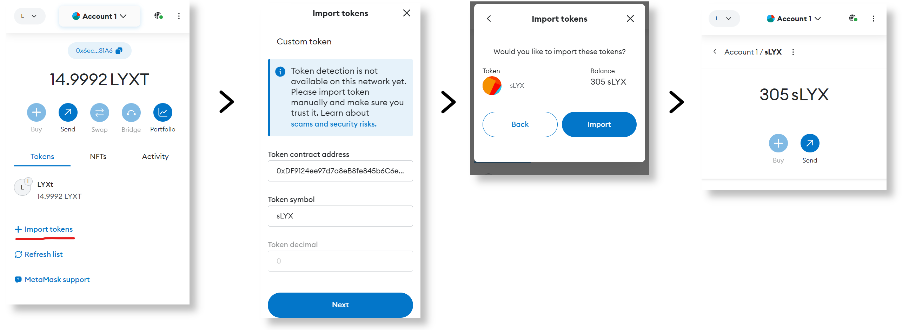

# Importing sLYX to your wallet

## Quick reference

sLYX address on LUKSO mainnet: 0xDF9124ee97d7a8eB8fe845b6C6eE8a8D75B55a57

Even though sLYX is based on the [LSP7 token standard](https://docs.lukso.tech/standards/nft-2.0/LSP7-Digital-Asset/), it is ERC-20 compatible and, consequently, you can import it to any wallet which handles ERC-20 tokens to track your balance from there.&#x20;

We'll walkthrough an example using Metamask browser extension on desktop.&#x20;

1. Log in to Metamask and select the [LUKSO mainnet](#user-content-fn-1)[^1], then select the option _Import Tokens._&#x20;
2. The smaller window titled "Import Tokens" will pop-up. Here you will introduce the StakedLyxToken contract address on mainnet, **0xDF9124ee97d7a8eB8fe845b6C6eE8a8D75B55a57**, and the token symbol, which is **sLYX**. Click next to confirm.
3. Because the address introduced corresponds to an ERC-20 compatible contract, Metamask will display the token symbol and your current balance and ask for confirmation on the import. Confirm in the "import" button.
4. sLYX is now listed under the tokens tab of the Metamask wallet.

Here is an illustration of the steps outlined above:

<figure><figcaption>
Importing the sLYX token into your wallet: an example using Metamask.
</figcaption></figure>

[^1]: You might need to add the LUKSO mainnet to your list of known networks
