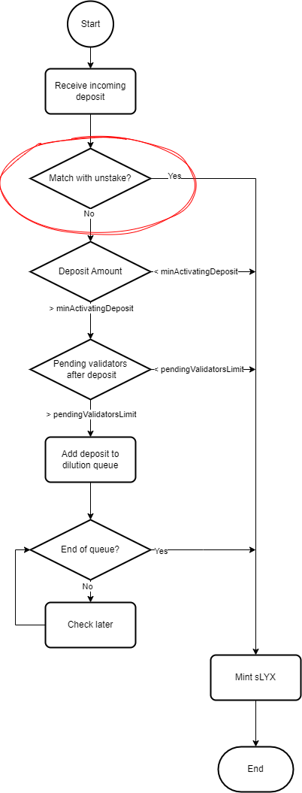

# Matching stake to unstake requests

When a new stake request reaches the Pool contract, the list of pending unstake requests is checked for a possible match. This match can be either total or partial, meaning a fraction of the stake request might be matched while the remainder follows the regular activation route. This system reduces transaction fees, as well as potential waiting times for both onboarding and exiting users.

<figure><figcaption>
Flow of the staking process inside the Pool contract. Notice that the matching mechanism kicks in right after the staking request reaches the pool.
</figcaption></figure>

The ideal situation is a full match, but it might happen that the amount entering the staking pool is higher than the amount pending to exit. In this scenario, a partial match occurs: some of the staker's sLYX will come from the matching system, and the rest is minted by the protocol. The part minted by the protocol is subject to [potential waiting times](potential-wait-times-while-staking.md), and might only be available a few hours to a few days later. In this situation, the fraction matched will immediately show up in the user's wallet after the staking transaction, and the fraction queued for activation will have to be [claimed ](../claiming/claim-queued-stake.md)at a later date.
