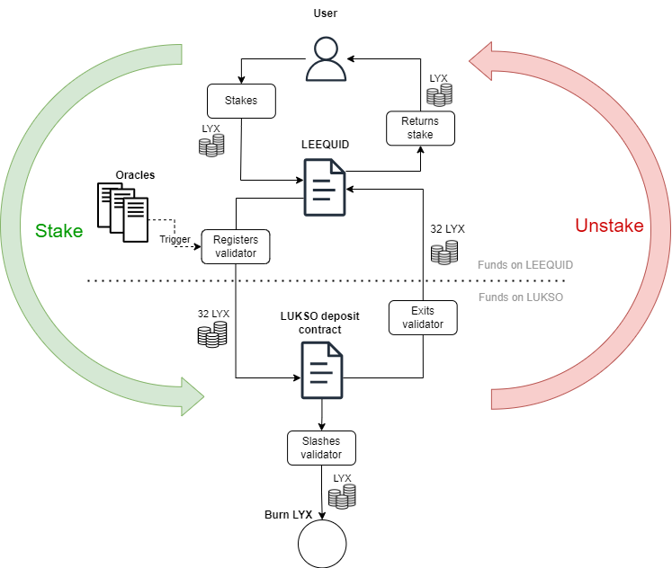

# Deposited LYX lifecycle

When a user stakes LYX through the LEEQUID staking pool, the coins are transferred to the Pool contract and they will sit there for a few minutes until LEEQUID’s oracles detect an amount bigger than 32 LYX sitting on the Pool contract. This is the condition that triggers the Oracles to register a new validator, transferring the stake from the Pool to the LUKSO official deposit contract. From here, the tokens can either be burned in the case of slashing, or sent to the withdrawal address when the validator exits the protocol.

<figure><figcaption>
LYX flow from the LEEQUID protocol to the LUKSO deposit contract
</figcaption></figure>

The diagram above illustrates the non-custodial flow of funds from the user address into the LEEQUID protocol and finally to the official deposit contract of LUKSO. Once in there, the LUKSO contract has control over the staked amounts and can use it to slash the validators in case of bad behavior or give it back, once an exit request successfully goes through.
