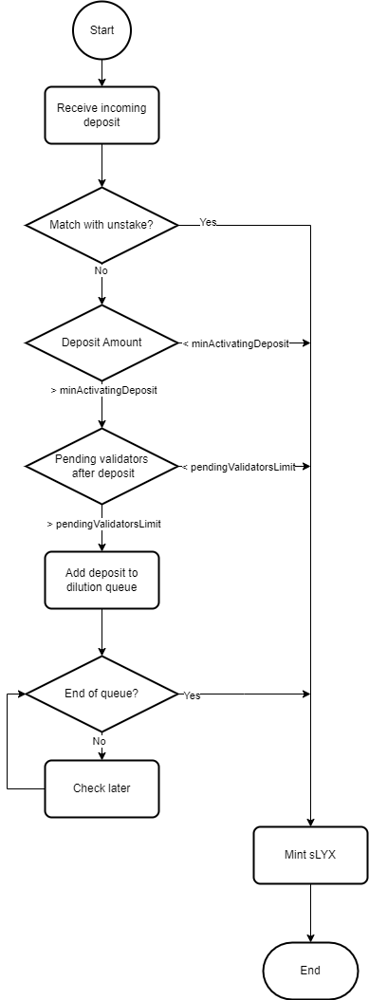

# The staking protocol

When a user presses the stake button and confirms the transaction in the LEEQUID platform, the chosen amount of LYX is transferred from his account to the pool contract. The LYX will sit in the contract for a few minutes until the oracles detect it and initiate the registration of new validators, transferring that LYX to the official deposit contract of LUKSO.

An [LSP7](https://docs.lukso.tech/standards/nft-2.0/LSP7-Digital-Asset/) token called stakedLYX (sLYX) will be minted in the same amount as the LYX staked. This token represents ownership of that LYX and can be redeemed at any time. Sometimes, the minting of the sLYX token might not be instant, and instead the user’s staking request will be added to a queue for delayed minting of sLYX (see [dilution queue](https://www.notion.so/beb6b3f841a245d385412cc0a5853cc4?pvs=21)). In this scenario, a claim action will be available for the user once his address reaches the end of the queue and the funds are transferred to the LUKSO deposit contract.

Below is a flowchart illustrating what happens inside the LEEQUID protocol when a user triggers a staking request by making a deposit in the Pool contract:

<figure><figcaption>
Flow of the staking process inside the Pool contract
</figcaption></figure>

Notice that the process goes through a sequence of exit paths, which result in an immediate minting of sLYX. If it fails to enter any of the “escape” paths, the deposit is added to the dilution queue. \
\
The current value for minActivatingDeposit is 1 LYX and pendingValidatorsLimit is actually a percentage of the total activated validators, in this case defined as 10% upon the deployment of LEEQUID on mainnet. \
\
The protocol halts the minting of sLYX when the total pending stake is more than 10% of the total staked amount. Minting is resumed as soon as some of the pending stake is transformed into active validators (may take 1-3 days), shrinking the pending stake pool to below 10% of the total stake.
